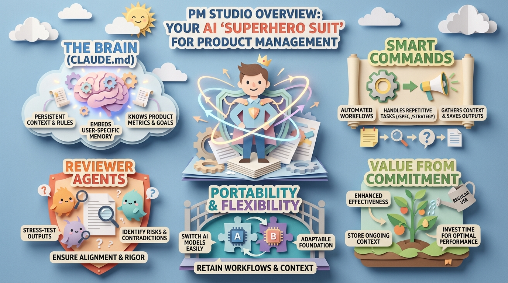

<p align="center">
  
</p>

# PM Studio

A Claude Code workspace layer for product managers. Built on top of the [Anthropic product-management plugin](https://github.com/anthropics/claude-code-plugins), PM Studio adds personal context, voice matching, a knowledge base, quality standards, and a refinement agent pipeline to every command you run.

## How It Works

PM Studio uses a **layered architecture**:

- **The plugin** provides commands (`/product-management:*`), deep methodology (6 skills), and MCP connectors. It auto-updates from the marketplace.
- **PM Studio** provides the workspace: agents, personal context, notes, voice matching, output organization, and quality standards (via `CLAUDE.md`).

When you work inside the PM Studio workspace with the plugin installed, both layers are active. CLAUDE.md enhances everything.

Or, as [DreamerAlbert](https://github.com/DreamerAlbert) brilliantly visualized it:




## Prerequisites

**Required:**
- [ ] [Claude Code](https://docs.anthropic.com/en/docs/claude-code) (VS Code extension or CLI)
- [ ] Anthropic product-management plugin:
  ```bash
  claude plugin marketplace add product-management@knowledge-work-plugins
  ```

**Required:**
- [ ] WorkIQ MCP for Microsoft 365 integration (emails, meetings, documents). Pre-configured in PM Studio's `.mcp.json` and starts automatically. Accept the EULA on first use.

**Optional:**
- Additional MCP connectors (Slack, Linear, Figma, etc.) can be added to `.mcp.json`
- [Superwhisper](https://superwhisper.com/) for voice-based brainstorming

> **WorkIQ is always on.** Every command (plugin and PM Studio) queries WorkIQ for relevant emails, meetings, and documents by default. Tell Claude to skip it if you don't want it for a specific command.


## Quick Start

### 1. Get PM Studio

```bash
git clone https://github.com/zoekdestep/pm-studio.git
```

Or download as ZIP from the GitHub repository page.

### 2. Open in VS Code

Open the `pm-studio` folder in VS Code, then open the Claude Code panel.

### 3. Personalize

Fill in your context files:

| File | What to Add |
|------|-------------|
| `context/about-me.md` | Your role, stakeholders, priorities, PM philosophy |
| `context/product-context.md` | Product strategy, user segments, metrics, competitive landscape, technical constraints |
| `context/tone-and-voice.md` | Your writing style (good defaults included) |
| `context/examples/` | 4-5 of your best docs (these drive both voice AND structure for all output) |

### 4. Start Writing

Run any command. For example:

```
/product-management:write-spec
/strategy competitive-positioning
/shipping dark-mode
```

CLAUDE.md automatically enhances every command with your context, voice, and quality standards.

See [NEXT-STEPS.md](NEXT-STEPS.md) for a complete getting-started walkthrough.


## Commands

### PM Studio Commands

| Command | Purpose | Output |
|---------|---------|--------|
| `/strategy [topic]` | Write a research-backed strategy doc | `output/strategies/` |
| `/shipping [feature]` | Write a shipping decision with metrics and recommendation | `output/shipping-decisions/` |
| `/note [content]` | Capture a note to your knowledge base | `notes/` |
| `/word [file]` | Export markdown to Word | `output/` |

### Product-Management Plugin Commands

| Command | Purpose | Output |
|---------|---------|--------|
| `/product-management:write-spec` | Write a feature spec or PRD | `output/specs/` |
| `/product-management:roadmap-update` | Create or reprioritize a roadmap | `output/roadmaps/` |
| `/product-management:stakeholder-update` | Generate a stakeholder update | `output/stakeholder-updates/` |
| `/product-management:metrics-review` | Review and analyze product metrics | `output/metrics-reviews/` |
| `/product-management:competitive-brief` | Create a competitive analysis brief | `output/competitive-briefs/` |
| `/product-management:synthesize-research` | Synthesize user research into insights | `output/research-syntheses/` |

All plugin commands are enhanced by PM Studio's context loading, voice matching, auto-save, and agent offering.


## Agents

PM Studio's unique value: a post-generation refinement pipeline. After any document is generated (plugin or PM Studio), run agents to improve it.

| Agent | What It Does | Best For |
|-------|--------------|----------|
| **reviewer** | Two-pass review: structural completeness + Socratic reasoning analysis | All docs |
| **editor** | Reads your voice examples, applies full editorial pass | All docs before sharing |
| **edge-case-finder** | Surfaces scenarios, risks, and failure modes | Specs, roadmaps |
| **metrics-designer** | Suggests KPIs, guardrails, and measurement plans | Specs, shipping decisions |
| **question-generator** | Surfaces questions worth exploring | Strategy, research |

Common flow: generate a doc, run **reviewer** to find gaps, run **editor** for polish.


## Connector Architecture

**WorkIQ (always on):** Every command queries WorkIQ for M365 data (emails, meetings, transcripts, documents) by default. No setup needed beyond accepting the EULA on first use.

**Optional connectors** use `~~category` placeholders for additional data:

| Category | Data Source | Example MCP |
|----------|-----------|-------------|
| `~~product analytics` | Usage metrics, trends | Your analytics MCP |
| `~~user feedback` | Support tickets, sentiment | Your feedback MCP |
| `~~project tracker` | Work items, rollout status | Linear, Jira MCPs |

Optional connectors are skipped silently when not available. See [CONNECTORS.md](CONNECTORS.md) for details.


## Workspace Structure

```
pm-studio/
├── .claude/
│   ├── agents/              # 5 refinement agents
│   └── commands/            # PM Studio commands
├── context/
│   ├── examples/            # Your reference docs (voice + structure)
│   ├── about-me.md          # Role, preferences, PM philosophy
│   ├── product-context.md   # Strategy, metrics, competitors, tech constraints
│   └── tone-and-voice.md    # Writing style guide
├── notes/
│   ├── ideas/               # Raw ideas, hunches
│   ├── research/            # User research, data findings
│   └── reading/             # Articles, books, learnings
├── output/                  # Auto-saved documents (8 subdirectories)
├── .mcp.json                # MCP server config (WorkIQ)
├── CLAUDE.md                # Workspace enhancement layer
├── CONNECTORS.md            # Connector architecture
└── NEXT-STEPS.md            # Getting started guide
```


## Customization

**Voice**: Put your best docs in `context/examples/`, edit `context/tone-and-voice.md`. The editor agent uses both.

**Agents and commands**: Add `.md` files to `.claude/agents/` or `.claude/commands/`. Or ask Claude to create them for you.

**Connectors**: Add MCP servers to `.mcp.json` and map them to `~~category` placeholders in commands. WorkIQ is always on by default.


## Credits

This project was inspired by [SEOMachine](https://github.com/TheCraigHewitt/seomachine) by Craig Hewitt. The product-management methodology comes from the [Anthropic product-management plugin](https://github.com/anthropics/claude-code-plugins).


## License

MIT
